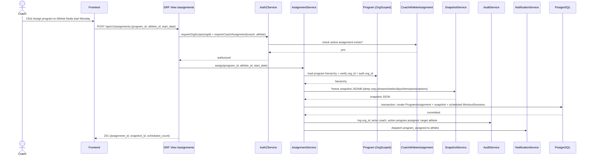
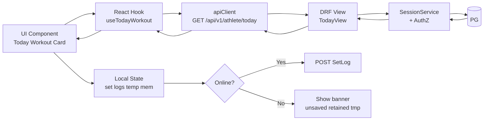

# Component Boundaries — Frontend & Backend

**Version:** 1.0.0 Phase 03  
**Context:** Expands CONTAINER_ARCHITECTURE into component-level boundaries within each container.

---

## 1. Frontend Component Architecture (Next.js)

### 1.1 High-Level Structure (Proposed, not implemented)

```
/frontend (proposed, not scaffolded in Phase 03)
  /app
    /[locale]/(auth)/register/page.tsx — SCR-AUTH-01
    /[locale]/(auth)/login/page.tsx — SCR-AUTH-02
    /[locale]/(app)/today/page.tsx — SCR-ATH-01
    /[locale]/(app)/workouts/[id]/page.tsx — SCR-ATH-02
    /[locale]/(coach)/programs/[id]/builder/page.tsx — SCR-COACH-06
    ...
  /components
    /ui — Btn, Input, Modal (focus-trapped), DatePicker (Jalali/Gregorian)
    /domain — WorkoutCard, ProgramTree, ExerciseCard, RestTimer, ConsentModal
    /layout — BottomNav, Sidebar, TopBar (OrgSwitcher, LangSwitcher)
  /lib
    /api — apiClient (fetch wrapper, auth, Accept-Language, idempotency key)
    /auth — session handling, org context
    /i18n — next-intl or i18next, fa-IR.json/en-US.json, number/date formatting
    /pwa — manifest, serviceWorker registration, offline fallback, network status hook
    /search — Persian Unicode folding client-side helper (mirrors backend normalization)
  /styles — design tokens CSS variables, logical properties only, Vazirmatn + Inter
```

### 1.2 Frontend Boundaries

- **Pages** may only import from `/components`, `/lib/api`, `/lib/i18n`, `/lib/pwa`; never directly import backend models.
- **apiClient** centralizes: auth header/cookie, `Accept-Language`, error parsing RFC7807, rate-limit retry, correlation ID `X-Request-ID`.
- **PWA layer** isolated: SW registration, app-shell caching (Phase04), temp memory preservation (Phase07), IndexedDB queue (Phase12 future) — never blocks main rendering.
- **i18n** layer enforces zero hardcoded strings; lint rule `no-restricted-syntax` to disallow literal strings in JSX without `t()`? Proposed for Phase04.
- **Security:** All user-generated HTML (exercise instructions, messages) sanitized via DOMPurify client-side defense-in-depth; server still encodes.

### 1.3 Frontend → Backend Contract

- Via `docs/OPENAPI.yaml` provisional spec.
- Versioned under `/api/v1`.
- Localization via `Accept-Language` header + user preferred_locale fallback.

---

## 2. Backend Component Architecture (Django Modular Monolith)

### 2.1 Proposed Django App Layout (Conceptual, not scaffolded)

```
/backend (proposed, not created in Phase 03)
  /config — settings, URLs, WSGI/ASGI, middleware (OrgScopeMiddleware, AuthZMiddleware, RequestIDMiddleware, SecurityHeaders)
  /apps
    /identity — User model, AuthService, token/session, password reset, rate limiter
    /organizations — Organization, Location, OrgService, slug validation
    /memberships — Membership, Invitation, InvitationService, token hash
    /authorization — AuthZService, CoachAthleteAssignment, ConsentRecord, permissions.py (DRF permissions)
    /exercises — Exercise, ExerciseTranslation, ExerciseAlias, search service (Trigram + normalization)
    /media — MediaAsset, MediaRights, ModerationAction, MediaService (S3 abstraction, signed URLs)
    /programs — Program hierarchy (Phase, Week, Day, Workout, Item, SetPrescription), builder service
    /assignments — ProgramAssignment, SnapshotService (JSONB immutable), versioning
    /sessions — WorkoutSession, SetLog, Substitution, SessionService, adherence calculator
    /progress — FeedbackFlag, BodyMetric, ProgressPhoto, ProgressService
    /messaging — Thread, Message, MessageService
    /notifications — Notification, Preference, NotificationService, EmailProviderAbstraction
    /audit — AuditEvent model + manager with no update/delete, AuditService
    /privacy — ExportRequest, ErasureRequest, PrivacyService, Celery tasks
    /adminplatform — Admin views, moderation queue, break-glass logic
    /common — mixins, base models (TimeStamped, TenantScoped, SoftArchive), pagination, error envelope, PersianNormalizer utility, idempotency
  /tests — mirrors apps structure, mandatory negative authz tests per sensitive endpoint
```

### 2.2 Component Interaction Example (Program Assignment)



### 2.3 Middleware Stack (Proposed)

- `RequestIDMiddleware` — generate `X-Request-ID` UUIDv7 or propagate if provided; attached to logs.
- `SecurityHeadersMiddleware` — HSTS, CSP, X-Frame-Options, etc.
- `OrgScopeMiddleware` — extracts active `organization_id` from authenticated session/membership; makes available as `request.org_id`. Never trust client-supplied org_id query param alone.
- `AuthZMiddleware` placeholder — sets user + membership context.
- `AuditMiddleware` — logs auth events.

### 2.4 Domain Boundaries Enforcement

- Every app's `services.py` exposes public interface; `models.py` owned entities; `permissions.py` DRF permissions importing AuthZService; `serializers.py` validation + localization.
- No `from apps.sessions.models import ...` inside `apps.identity` — hierarchy enforced.
- Allowed cross-app reads via service layer only, not direct ORM across boundaries except via AuthZService and common mixins.
- Lint: proposed `import-linter` config in `setup.cfg` / `pyproject.toml` (Phase04).

---

## 3. Shared Kernel — `/common`

- `TimeStampedModel` — `id` (UUIDv7 proposed), `created_at` timestamptz, `updated_at` timestamptz, `archived_at` nullable for soft-archive pattern.
- `TenantScopedModel` — `organization_id` FK + index + mandatory filter helper `for_org(org_id)` queryset method.
- `PersianNormalizer` utility — Perso-Arabic script keyboard-variant normalization for Persian search: folds `ي/ى → ی`, `ك → ک`, Arabic-Indic digits, removes ZWNJ for tokenization, trims diacritics optionally.
- `ErrorEnvelope` — RFC7807 style formatter with `type`, `title`, `status`, `detail`, `instance`, `message_key`.
- `Idempotency` — optional table storing `Idempotency-Key` header + response, for critical writes (invite, assign, payment future).
- `Pagination` — cursor or offset? Proposed cursor for large logs.

---

## 4. Frontend ↔ Backend Data Flow (Conceptual)



Temporary in-memory preservation (Phase07) — no IndexedDB — set logs held in React state, yellow banner "Offline — unsaved input retained temporarily; retry required after reconnection". Durable queue only Phase12.

---

## 5. Security Boundaries at Component Level (Corrected Secrets Boundary + Auth Transport Consistency)

- No component generates signed S3 URL without MediaService + AuthZ.
- **Secret Manager Boundary (Critical Correction):** No frontend component (including Next.js SSR Node.js serving frontend) ever accesses Secrets Manager directly. Private secrets (DB URL, Django SECRET_KEY, Redis URL, S3 credentials, email API keys, JWT signing keys) are available only to backend and worker runtimes via server-side secret injection (Secrets Manager / env at deploy time). Frontend receives only explicitly public runtime config (`NEXT_PUBLIC_*` such as `NEXT_PUBLIC_API_BASE_URL`, `NEXT_PUBLIC_APP_NAME`) — no private secrets in bundle, no rendering private secrets in server props, no proxying private secrets via API.
- **Auth Transport Consistency (Corrected — ADR-032):**
  - **Recommended MVP:** HttpOnly/Secure/SameSite cookie sessions (Django `sessionid`):
    - HttpOnly true (JS inaccessible, prevents XSS theft), Secure true (HTTPS only), SameSite=Lax (prevents CSRF cross-site POST, balances usability vs Strict).
    - CSRF strategy for cookie-based mutations: double-submit token or Django CSRF middleware — frontend reads `csrftoken` cookie (non-HttpOnly) and sends `X-CSRFToken` header for POST/PATCH/DELETE; SameSite=Lax additional layer; verify CSRF on server.
    - No long-lived tokens in localStorage/sessionStorage — explicit prohibition.
  - **Optional Alternative (Bearer/JWT):** If bearer/JWT retained:
    - Short-lived access tokens ≤15min in memory (React state/memory, not localStorage), rotating refresh tokens in HttpOnly Secure SameSite cookie with reuse detection — if refresh reuse detected (token already rotated), revoke all sessions and alert.
    - Explicit prohibition: never store long-lived refresh or access tokens in localStorage/sessionStorage.
    - Frontend/backend trust boundary: frontend untrusted, backend authoritative, all checks server-side.
  - **Final Choice:** Recommended first implementation is cookie sessions (simpler, built-in Django CSRF). JWT alternative remains optional, marked proposed/conditional requiring Phase04 validation — both schemes documented in OPENAPI.yaml securitySchemes but recommendation documented in ADR-032.
- All user content sanitized both server and client.
- Rate limiter checked in DRF throttling (DRF `AnonRateThrottle`, `UserRateThrottle` backed by Redis).

---

## 6. References

- `DOMAIN_MODULES.md`, `CONTAINER_ARCHITECTURE.md`, `AUTHORIZATION_ARCHITECTURE.md`, `DATA_FLOW.md`
