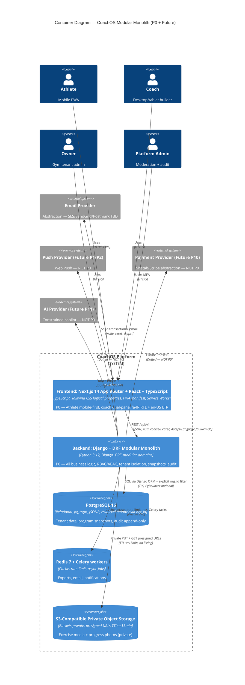
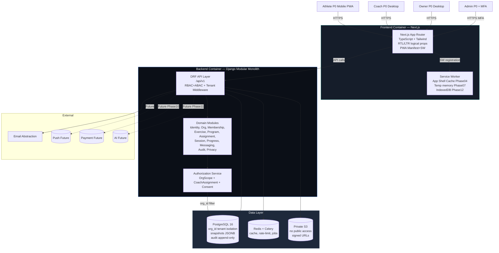

# Container Architecture — CoachOS

**Version:** 1.0.0 (Phase 03)  
**Status:** Proposed — modular monolith accepted (ADR-001)  
**Last updated:** 2026-08-10  
**Style:** C4 Level 2 Container + Module Boundaries

---

## 1. Overview

CoachOS uses a modular monolith deployment model for P0 MVP: single deployable backend (Django) + frontend (Next.js) + PostgreSQL + Redis + S3-compatible private storage. Domain modules are isolated via package boundaries, public interfaces, and architectural linting, not separate network services.

This avoids microservices operational overhead while preserving extraction path if needed later.

---

## 2. Container Diagram (Mermaid)

### Fallback Generic Flow

---

## 3. Containers Detailed

### 3.1 Frontend — Next.js + React + TypeScript (Corrected Secrets Boundary)

- **Responsibility:** All UI rendering, PWA lifecycle, i18n resource loading, client-side validation, network status indicator, temporary form preservation (Phase 07), offline fallback shell (Phase 04).
- **Key Tech:** Next.js 14 App Router (proposed), React 18, TypeScript 5, Tailwind CSS with logical properties, Vazirmatn + Inter fonts, next-pwa or custom SW.
- **Boundaries (Corrected):**
  - No direct DB access, no server-side authz bypass.
  - **No secret handling — CRITICAL CORRECTION:** Browser and frontend runtime MUST NEVER access Secrets Manager directly. Private secrets (DB URLs, Django secret keys, Redis credentials, S3 credentials, email API keys, JWT signing keys) are available only to backend and worker runtimes via server-side injection. Frontend receives only explicitly public runtime config (`NEXT_PUBLIC_*` vars such as `NEXT_PUBLIC_API_BASE_URL`, `NEXT_PUBLIC_APP_NAME`). Frontend MUST NEVER receive, render, bundle, or proxy private secrets. Relationship `FE --> SecretMgr` is forbidden and removed. Updated deployment topology shows `BE --> SecretMgr` and `Worker --> SecretMgr` only, and `FE -->|Public runtime config only, NO private secrets| BE`.
  - Auth via HttpOnly cookie (recommended MVP) or short-lived Bearer token in memory — never long-lived token in localStorage (see ADR-032 corrected).
- **PWA Sequencing:**
  - Phase 04: Manifest, icons 192/512 maskable, standalone display, SW registration, app-shell caching, offline fallback page.
  - Phase 07: Today view with cached program snapshot read, touch-optimized logging with 44/48px targets, network indicator, retry banner, no durable queue.
  - Phase 12: IndexedDB (Dexie or similar) durable workout queue, background sync, conflict resolution.
- **Security:** CSP headers prefer nonce/hash-based `script-src` in production (see DEPLOYMENT_ARCHITECTURE.md corrected CSP strategy), no `unsafe-inline` as accepted production control unless temporary exception documented with risk and hardening task TODO-CSP-001, no `dangerouslySetInnerHTML` with user content without sanitization, XSS encoding. Public runtime config only, no private secrets in bundle — verified via CI bundle secret scan.

### 3.2 Backend — Django + DRF Modular Monolith (Corrected Secrets Boundary)

- **Responsibility:** All business logic, tenant isolation, RBAC/ABAC, domain invariants (snapshot immutability, consent gating). **Only backend and worker runtimes may access Secrets Manager** via server-side injection — private secrets (DB URL, Django SECRET_KEY, Redis URL, S3 keys, email API key, JWT signing keys) are injected as env vars from Secrets Manager at deploy time, never committed, never exposed to frontend. Frontend receives only public config via `NEXT_PUBLIC_*`.
- **Tech:** Python 3.12, Django 5.x (proposed), DRF, Django ORM, Celery.
- **Modularity:** `apps/` packages per domain (see DOMAIN_MODULES.md). Dependencies enforced via import lint (e.g., `import-linter` or `django-deps` checks).
- **Auth (Corrected Consistency — See ADR-032 Updated):**
  - **Recommended MVP Strategy:** HttpOnly/Secure/SameSite cookie sessions (Django sessionid) — HttpOnly true (JS inaccessible), Secure true (HTTPS only), SameSite=Lax (CSRF mitigation Lax, Strict option for state-changing? Proposed Lax for usability, Strict for sensitive? Document as Lax). No long-lived token in localStorage — explicit prohibition. Short-lived access via session cookie, no JWT needed for MVP. CSRF: double-submit token or Django CSRF middleware for cookie-based mutations, SameSite=Lax + CSRF token in header `X-CSRFToken` for POST/PATCH/DELETE.
  - **Optional Alternative (Bearer/JWT):** If bearer/JWT retained as alternative, short-lived access tokens ≤15min in memory (not localStorage) + rotating refresh tokens in HttpOnly cookie with reuse detection revoking all sessions on reuse. Explicit prohibition: never store long-lived refresh/access tokens in localStorage/sessionStorage. Frontend/backend trust boundary: frontend untrusted, backend authoritative, auth checks server-side only.
  - **Final Choice:** Recommended MVP is cookie sessions (simpler CSRF handling via Django). JWT alternative remains optional but marked proposed/conditional requiring Phase04 validation — keep both security schemes in OPENAPI.yaml but document recommendation. Rate limit 5/15min on auth endpoints via Redis.
- **Authorization:** Middleware extracts active `organization_id` from authenticated user + membership; every tenant-scoped queryset filters by org; CoachAssignment service validates coach-athlete binding.
- **Audit:** Signal/hook on sensitive mutations emits `AuditEvent` immutable.

### 3.3 PostgreSQL 16 (Proposed)

- **Responsibility:** Source of truth; tenant-isolated tables; JSONB snapshots; full-text + `pg_trgm` for exercise search; Jalali UI handled in frontend, storage UTC `timestamptz`.
- **Extensions:** `pg_trgm` (trigram search), `btree_gin`, `pgcrypto`/`uuid-ossp` for secure ID generation pending UUIDv7 validation; proposed use of `pg_cron` optional for cleanup.
- **Migrations:** Django migrations — no manual SQL in repo (conceptual DDL in ERD.md only).
- **Backups:** PITR + daily snapshots (see BACKUP_AND_DISASTER_RECOVERY.md).

### 3.4 Redis 7 + Celery

- **Responsibility:** Cache (exercise catalog queries, permission lookups), rate limiting counters (login, export), Celery beat + workers for email dispatch, export packaging, erasure pipeline, audit aggregation.
- **Security:** No PII or health data in cache values if possible, or short TTL ≤ 5min; encrypted in transit if provider requires.

### 3.5 S3-Compatible Private Object Storage

- **Responsibility:** Stores exercise demo media (canonical + org-private), progress photos (Tier 4 sensitive), organization branding logos.
- **Security:** Buckets private (`BlockPublicAcls=true`, `IgnorePublicAcls=true`), no listing, versioning enabled, server-side encryption AES-256/SSE-S3; access via presigned GET TTL ≤ 15 min, validated via authz service before generation; upload validation MIME, size ≤ 10MB image / 100MB video (proposed), checksum SHA256.
- **Future CDN:** Optional CloudFront/Cloudflare with signed URL + Origin Access Identity, not caching Tier 4 media aggressively.

---

## 4. Network & Deployment Topology (Logical)

- **Frontend:** Edge-optimized static hosting (Vercel / Cloudflare Pages / S3+CDN) — proposed targets pending ADR.
- **Backend:** Single region initially, behind HTTPS load balancer, TLS 1.3, HSTS; auto-scaling group or container (ECS/Fargate/K8s) based on founder infra.
- **Data:** PostgreSQL managed (RDS/Cloud SQL) private subnet; Redis managed (ElastiCache/Upstash) private.
- **Storage:** S3 in same region (e.g., `eu-central-1` or Tehran-compatible region TBD — requires founder infra decision).

---

## 5. Communication Patterns

- **Sync REST:** Frontend → Backend `/api/v1` JSON, idempotency key on critical writes (invites, assignments) optional but recommended.
- **Async Jobs:** Backend enqueues Celery tasks → Redis → Worker executes email, export ZIP, erasure, notification dispatch.
- **No direct frontend to DB/storage/storage listing.**
- **No service-to-service REST for P0 (modular monolith internal Python imports).**

---

## 6. Failure Modes & Resilience

- **DB down:** API returns 503, frontend shows server error state + retry; audit events buffered? No — must fail fast; no durable queue until Phase 12 for client.
- **Redis down:** Rate limiting fallback to in-memory (stampede risk) — degrade gracefully, log alert; Celery tasks retry with exponential backoff.
- **S3 down:** Media upload fails with retry banner; Tier 4 photos upload disabled; signed URL generation fails → 503.
- **Email down:** Enqueue retry 3x exponential backoff; invite still valid.

---

## 7. Non-Functional Targets (Proposed — Require Validation)

- API p95 read < 200ms, builder save < 400ms (up to 50th percentile, load test pending Phase 13).
- Today view < 1.5s on 3G (750kbps/100ms RTT) (engineering hypothesis, requires benchmark).
- Frontend JS < 150KB gzipped initial (target).

---

## 8. References

- `docs/DECISIONS.md` ADR-001 Modular Monolith, ADR-002 Stack
- `docs/architecture/SYSTEM_CONTEXT.md`
- `docs/architecture/DOMAIN_MODULES.md`
- `docs/architecture/DEPLOYMENT_ARCHITECTURE.md`
