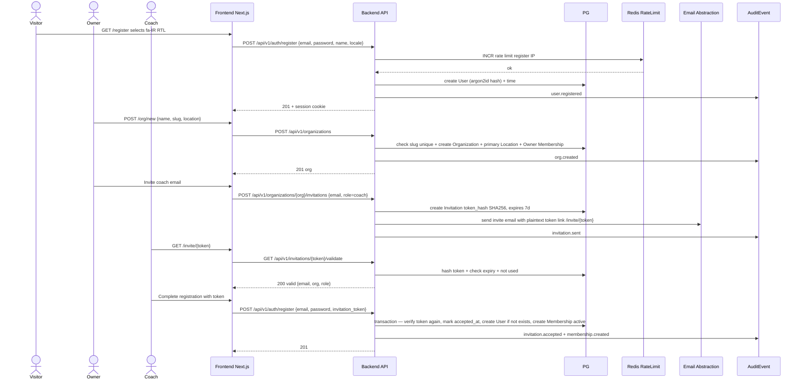
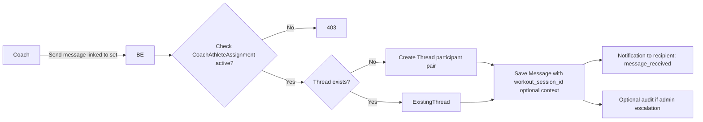
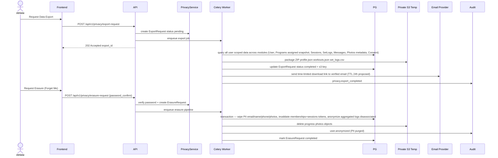

# Data Flow Architecture — CoachOS

**Version:** 1.0.0 Phase 03  
**Status:** Proposed  
**Scope:** P0 flows — auth, org/invite, program assignment, workout logging, progress photo consent, messaging, export/erasure.

---

## 1. Overview Principles

- **Tenant-scoped by default:** Every read/write derives `organization_id` from authenticated server context, never from client param alone.
- **Immutable snapshots:** Assignment flow freezes program hierarchy into JSONB snapshot — historical logs reference snapshot version, not mutable master.
- **Private media:** Never public URL — signed URL gated by AuthZ + Consent.
- **Audit:** All sensitive mutations/reads emit immutable AuditEvent.

---

## 2. Auth & Onboarding Flow (Register → Org Creation → Invite)



**Idempotency:** Invite acceptance single-use — second attempt 410 Gone. Token hash stored, not plaintext.

---

## 3. Exercise Search with Persian Normalization

```mermaid
flowchart TB
    Input[User types Persian query<br/>'پرس سينه' Arabic Yeh] --> FE[Frontend optional pre-fold client]
    FE --> API[GET /api/v1/exercises?q=پرس سينه&locale=fa-IR]
    API --> Norm[PersianNormalizer Service<br/>Fold ي/ى→ی, ك→ک<br/>Strip ZWNJ, digits normalize<br/>Trigram prep]
    Norm --> DBQuery[PG Query<br/>WHERE organization_id IN (canonical NULL + user org)<br/>AND normalized_alias % normalized_query<br/>ORDER BY similarity DESC]
    DBQuery -->|pg_trgm + btree_gin| PG[(PostgreSQL<br/>exercises + translations + alias<br/>GIN trigram index)]
    PG --> Results[Results with highlight]
    Results --> APIResp[200 JSON with bilingual names]
    APIResp --> FE2[Frontend renders]
```

**Important:** No Arabic product support — normalization handles keyboard-variant input only, explained as "Perso-Arabic script keyboard-variant normalization for Persian search" (precise wording).

Indexes: `GIN (normalized_alias gin_trgm_ops)`, `GIN (name gin_trgm_ops)`.

---

## 4. Program Assignment & Snapshot Flow

Detailed in COMPONENT_BOUNDARIES.md sequence diagram. Summary:

- Coach creates program hierarchy via Builder API atomic transaction.
- Assignment endpoint verifies CoachAthleteAssignment exists, org scope matches.
- SnapshotService deep-copies phases/weeks/days/workouts/items/prescriptions into JSONB `snapshot_payload`.
- Transaction commits assignment + snapshot + generated scheduled WorkoutSessions (one per day in calendar range).
- Notification dispatched to athlete.
- Audit logged.

**Why snapshot?** Prevents future edits to master template corrupting historical logs. This satisfies "Avoid storing duplicated mutable data without clear snapshot/version reason" — snapshot duplication is justified immutability reason.

---

## 5. Workout Session Logging Flow

```mermaid
sequenceDiagram
    actor Athlete
    participant PWA as PWA Mobile
    participant API as Backend API
    participant AuthZ as AuthZ + Consent
    participant Session as SessionService
    participant DB as PG
    participant Notif as NotificationService
    participant Audit as Audit

    Athlete->>PWA: Open /app/today -> Start Workout
    PWA->>API: POST /api/v1/workout-sessions {assignment_id? scheduled_date}
    API->>AuthZ: require self athlete + org scope
    AuthZ-->>API: ok
    API->>Session: start(scheduled)
    Session->>DB: create WorkoutSession status in_progress
    DB-->>Session: session id
    Session-->>API: session
    API-->>PWA: 201 session

    loop Each Set
        Athlete->>PWA: Input load=80kg reps=8 RPE8 tap complete
        PWA->>PWA: local state + start 90s timer (client-side)
        alt Online
            PWA->>API: POST /api/v1/workout-sessions/{id}/set-logs {exercise_id, set_index, actual_reps, load_kg}
            API->>AuthZ: verify athlete owns session
            API->>Session: logSet()
            Session->>DB: insert SetLog
            DB-->>Session: ok
            Session-->>API: 201
            API-->>PWA: 201 set logged
        else Offline gym drop Phase07
            PWA->>PWA: Keep in React state (temporary)<br/>Show yellow banner<br/>'Offline — unsaved input retained temporarily; retry required after reconnection'<br/>No durable queue
            Note over PWA: Durable IndexedDB queue only Phase12
        end
    end

    Athlete->>PWA: Finish Workout + optional pain flag
    PWA->>API: POST /api/v1/workout-sessions/{id}/complete {session_rpe, fatigue, notes, pain_flag?}
    API->>Session: complete + maybe FeedbackFlag
    Session->>DB: update session completed_at + create FeedbackFlag if present
    Session->>Notif: pain_flag_raised or workout_completed to coach
    Session->>Audit: session.completed
    API-->>PWA: 200 summary {total_volume, duration}
```

**Offline Boundary Explicit:**
- Phase04: Shell only offline fallback.
- Phase07: In-memory preservation, retry banner, no durable queue.
- Phase12: IndexedDB durable queue, background sync, conflict resolution.

---

## 6. Progress Photo Consent & Access Flow

```mermaid
sequenceDiagram
    actor Athlete
    actor Coach
    participant FE as Frontend
    participant BE as Backend API
    participant Consent as ConsentService
    participant MediaSvc as MediaService
    participant S3 as Private S3
    participant Audit as AuditEvent
    participant DB as PG

    Athlete->>FE: Click Upload Progress Photo
    FE->>BE: GET /api/v1/consent/photo/status
    BE->>Consent: check existing consent for coach assignment?
    Consent-->>BE: none or granted
    alt No consent yet
        BE-->>FE: 200 needs_consent=true
        FE->>FE: Show ConsentModal: 'Allow Coach Reza to view progress photos'
        Athlete->>FE: Grant Consent
        FE->>BE: POST /api/v1/consents {type=progress_photo, granted=true, grantee_coach_id}
        BE->>Consent: create ConsentRecord
        BE->>Audit: consent.granted
        BE-->>FE: 201 consent granted
    end
    FE->>BE: POST /api/v1/progress-photos multipart + storage validation
    BE->>MediaSvc: validate MIME (jpeg/png/webp) size <=10MB + generate private key progress/{athlete_id}/{uuid}.jpg
    MediaSvc->>S3: PUT private bucket
    S3-->>MediaSvc: ok
    MediaSvc->>DB: create ProgressPhoto record with storage_key + consent link
    BE-->>FE: 201

    Coach->>FE: Request view athlete photo gallery
    FE->>BE: GET /api/v1/athletes/{athlete_id}/progress-photos
    BE->>Consent: check consent active + CoachAthleteAssignment active?
    Consent-->>BE: granted
    BE->>MediaSvc: generate signed URL TTL<=15min per photo
    MediaSvc->>S3: presign GET
    S3-->>MediaSvc: signed URL
    MediaSvc-->>BE: urls
    BE->>Audit: photo.viewed (audited sensitive read)
    BE-->>FE: 200 {photos + signed urls}

    Note over FE,BE: Support role DENIED — 403 always; Owner raw photo requires explicit consent + audited escalation, else 403
```

**No public URLs ever** — bucket listing disabled.

---

## 7. Messaging Flow (Contextual)



Message threads org-private, participant-scoped.

---

## 8. Privacy Export / Erasure Flows



Export link TTL proposed 24h, requires validation (proposed until verified in Phase04).

---

## 9. Audit Event Flow

- Every sensitive mutation writes via `AuditService.log()` inside same DB transaction when possible (atomic).
- If transaction fails, audit not created (consistent).
- For sensitive reads (progress photo viewed, global audit trail viewed by admin), audit write after successful read.
- Metadata sanitized: no raw passwords, no raw health details beyond type (flag_type), no full message content? Choose either hashed or truncated — propose only IDs and types, not full private message bodies.

---

## 10. References

- `ERD.md`, `DOMAIN_MODULES.md`, `AUTHORIZATION_ARCHITECTURE.md`, `MEDIA_STORAGE.md`, `PRIVACY_DATA_LIFECYCLE.md`
