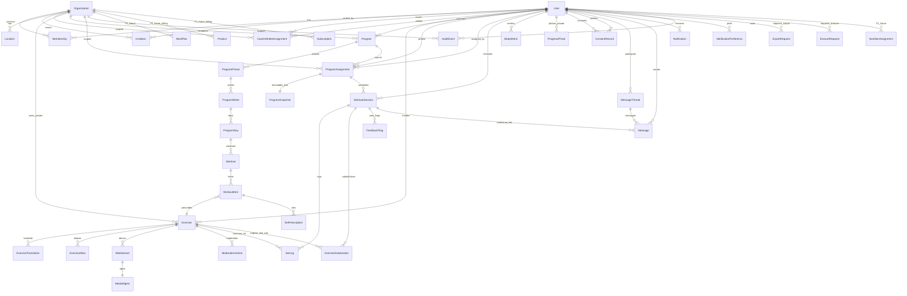

# Entity-Relationship Diagram — CoachOS

**Version:** 1.0.0 Phase 03  
**Status:** Proposed — conceptual/physical hybrid; Django migrations to be created in Phase04, NOT in Phase03  
**Identifier Strategy:** UUIDv7 proposed (ADR-017) — requires validation against PG/runtime; fallback UUIDv4 or BigInt possible. Never use identifier as authz substitute.  
**Tenant Isolation:** Every tenant-scoped entity includes explicit `organization_id` FK + index; queries filtered by auth server context.

---

## 1. Legend

- `PK` Primary Key (UUIDv7 proposed, time-ordered 128-bit)
- `FK` Foreign Key with implied index
- `UK` Unique Constraint
- `IDX` Additional Index
- `NN` Not Null
- `TSP` timestamptz UTC
- `JSONB` JSONB payload
- `ARCH` Soft-archive via `archived_at` timestamp nullable (not hard delete)
- Tenant ownership marked `ORG-SCOPED`
- Sensitive fields marked `SENSITIVE`

---

## 2. ERD Overview (Mermaid)



---

## 3. Detailed Entity Specifications

### 3.1 Identity & Tenancy

#### User
- **PK:** `id` UUIDv7 proposed
- **Fields:**
  - `email` VARCHAR(255) UK IDX NN SENSITIVE (Tier1)
  - `password_hash` VARCHAR(255) NN — Argon2id/bcrypt — never log
  - `display_name` VARCHAR(150) NN
  - `phone_number` VARCHAR(32) NULL — optional for future OTP
  - `preferred_locale` VARCHAR(10) default `fa-IR` or `en-US` NN — only fa/en allowed
  - `preferred_unit` VARCHAR(10) default `kg` — kg/lbs
  - `timezone` VARCHAR(50) default `UTC` or `Asia/Tehran`
  - `is_platform_admin` BOOL default false — break-glass role
  - `is_active` BOOL default true — deactivation hard blocks auth
  - `created_at` TSP NN
  - `updated_at` TSP NN
- **Indexes:** UK email, is_platform_admin
- **State Machine:** active ↔ deactivated (via admin)
- **Soft-delete:** No — anonymization pipeline via erasure instead (ADR-016)
- **Audit:** `user.registered`, `user.login_failed`, `user.deactivated`
- **Retention:** Until erasure request; anonymized aggregates disassociated.

#### Organization
- **PK:** `id` UUIDv7
- **Fields:**
  - `name` VARCHAR(150) NN
  - `slug` VARCHAR(100) UK IDX NN — URL friendly unique
  - `owner_user_id` FK User NN
  - `settings` JSONB — branding, defaults
  - `created_at` TSP NN
  - `archived_at` TSP NULL ARCH
- **Indexes:** slug unique, owner_user_id
- **Tenant ownership:** Self is tenant root
- **State:** active, archived
- **Audit:** org.created, org.archived

#### Location (Single-Location MVP)
- **PK:** `id` UUIDv7
- **FK:** `organization_id` FK Organization ORG-SCOPED IDX NN
- **Fields:** `name` VC150, `is_primary` BOOL default true (MVP enforces 1 primary per org via partial unique index), `address_line1` VC255 NULL, `city` VC100 NULL, `phone` VC32 NULL, `created_at` TSP
- **Constraint:** Partial unique `UNIQUE(organization_id) WHERE is_primary=true` (enforce single primary)
- **Indexes:** organization_id

#### Membership
- **PK:** `id` UUIDv7
- **FKs:** `user_id` FK User IDX, `organization_id` FK Organization ORG-SCOPED IDX
- **Fields:** `role` VARCHAR(30) NN — owner/coach/athlete/support, `status` VARCHAR(20) default active — invited/active/suspended, `created_at` TSP
- **Constraint:** `UNIQUE(user_id, organization_id, role)` — allows multi-role per org? Actually proposal ADR-014 multi-role; unique per user+org+role permits coach+athlete same org if needed but MVP mostly single role.
- **Indexes:** organization_id, user_id, status
- **State:** invited → active → suspended/archived
- **Audit:** membership.created, status_changed

#### Invitation
- **PK:** `id` UUIDv7
- **FK:** `organization_id` OrgScoped IDX, `invited_by_user_id` FK User
- **Fields:** `email` VC255 IDX SENSITIVE, `role` VC30 NN, `token_hash` VC255 UK IDX NN — SHA256 of single-use token, `expires_at` TSP NN (7d), `accepted_at` TSP NULL, `created_at` TSP NN
- **Indexes:** token_hash unique, email, org
- **State:** pending, accepted, expired, revoked
- **Audit:** invitation.sent, accepted, revoked
- **Security:** Plaintext token only in email, never stored.

#### CoachAthleteAssignment
- **PK:** `id` UUIDv7
- **FK:** `organization_id` OrgScoped IDX, `coach_user_id` FK User IDX, `athlete_user_id` FK User IDX
- **Fields:** `status` VC20 default active — active/archived, `created_at` TSP
- **Constraint:** `UNIQUE(organization_id, coach_user_id, athlete_user_id)`
- **Audit:** assignment.created, archived
- **Purpose:** Object-level authz — coach can only access athlete if active assignment exists.

### 3.2 Exercise Catalog

#### Exercise
- **PK:** `id` UUIDv7
- **FK:** `organization_id` FK Organization NULL IDX — NULL=canonical global, non-NULL=private custom
- **FK:** `created_by_user_id` FK User NULL
- **Fields:** `movement_pattern` VC50 NN enum: squat/hinge/horizontal_push/pull/vertical_push/pull/lunge/carry/isolation/cardio/other, `difficulty` VC20 enum beginner/intermediate/advanced, `primary_muscles` TEXT[] — e.g. [quadriceps, glutes], `secondary_muscles` TEXT[], `equipment_required` TEXT[], `status` VC20 default published enum draft/pending_review/published/archived, `created_at` TSP, `updated_at` TSP
- **Indexes:** organization_id, status, movement_pattern, GIN primary_muscles optionally
- **State:** draft → pending_review → published/archived/rejected
- **Audit:** exercise.created_private, published, archived

#### ExerciseTranslation
- **PK:** `id` UUIDv7
- **FK:** `exercise_id` FK Exercise IDX
- **Fields:** `locale` VC10 IDX NN — fa-IR/en-US only, `name` VC200 NN, `instructions` TEXT, `coaching_cues` TEXT[], `common_mistakes` TEXT[], `safety_notes` TEXT NULL
- **Constraint:** `UNIQUE(exercise_id, locale)`
- **Localization:** fa-IR RTL, en-US LTR; BiDi isolation for Latin names inside Persian.

#### ExerciseAlias
- **PK:** `id` UUIDv7
- **FK:** `exercise_id` IDX
- **Fields:** `locale` VC10, `alias` VC200 raw, `normalized_alias` VC200 IDX — Perso-Arabic script keyboard-variant normalization for Persian search: fold ي/ى→ی, ك→ک, Arabic-Indic digits, ZWNJ stripped; indexed via pg_trgm
- **Indexes:** GIN trigram on normalized_alias

#### MuscleGroup / Equipment / MovementPattern (optional taxonomy)
- Could be enum columns or separate lookup tables for extensibility. For MVP, use enum arrays + translation via code; future table if admin curated taxonomy needed.
- Fields: `code` VC50 UK, `name_fa` VC100, `name_en` VC100
- No Arabic.

#### MediaAsset
- **PK:** `id` UUIDv7
- **FK:** `exercise_id` FK Exercise NULL? For progress photos, null but linked via ProgressPhoto; for exercise demos, linked to Exercise.
- **Fields:** `media_type` VC20 NN enum video_mp4/image_webp/image_jpeg/animation_gif, `storage_key` VC500 NN — S3 private key e.g., `exercises/{id}/{uuid}.mp4`, `thumbnail_storage_key` VC500 NULL, `duration_seconds` INT NULL, `bytes_size` BIGINT NN, `checksum_sha256` VC64 NN
- **Indexes:** exercise_id, media_type
- **State:** uploaded, processed, archived

#### MediaRights
- **PK:** `id` UUIDv7
- **FK:** `media_asset_id` Unique IDX FK MediaAsset
- **Fields:** `license_type` VC50 NN enum original_production/licensed_cc_by/commercial_license/coach_upload, `source_url` VC500 NULL, `creator_attribution` VC255 NN, `permitted_commercial_use` BOOL default true, `reviewed_by_user_id` FK User NULL, `reviewed_at` TSP NULL
- **Audit:** media.rights_reviewed

#### ModerationAction
- **PK:** `id` UUIDv7
- **FK:** `exercise_id` IDX, `moderator_user_id` FK User (admin)
- **Fields:** `action` VC30 — approve/reject/request_changes, `reason` TEXT NULL, `created_at` TSP
- **Audit:** exercise.moderated

### 3.3 Programming

#### Program
- **PK:** `id` UUIDv7
- **FK:** `organization_id` ORG-SCOPED IDX, `created_by_user_id` FK User
- **Fields:** `title` VC200 NN, `description` TEXT NULL, `target_goal` VC50 enum hypertrophy/strength/fat_loss/endurance/general_fitness, `is_template` BOOL default false — if true available to clone, `is_archived` BOOL default false, `created_at` TSP, `updated_at` TSP, `archived_at` TSP NULL
- **Indexes:** organization_id, is_template, created_by
- **State:** active, archived.

#### ProgramPhase
- **PK:** `id` UUIDv7
- **FK:** `program_id` FK Program IDX
- **Fields:** `name` VC150 NN e.g., Phase1 Accumulation, `sequence_order` INT NN, `duration_weeks` INT default 4
- **Indexes:** program_id, sequence_order
- **Constraint:** `UNIQUE(program_id, sequence_order)`

#### ProgramWeek
- **PK:** `id` UUIDv7
- **FK:** `phase_id` FK Phase IDX
- **Fields:** `week_number` INT NN, `focus_note` TEXT NULL
- **Constraint:** Unique per phase

#### ProgramDay
- **PK:** `id` UUIDv7
- **FK:** `week_id` FK Week IDX
- **Fields:** `day_number` INT NN, `title` VC150 e.g., Upper Body Power

#### Workout
- **PK:** `id` UUIDv7
- **FK:** `day_id` FK Day IDX
- **Fields:** `title` VC150, `estimated_minutes` INT NULL

#### WorkoutItem
- **PK:** `id` UUIDv7
- **FK:** `workout_id` FK Workout IDX, `exercise_id` FK Exercise IDX
- **Fields:** `sequence_order` INT NN, `group_key` VC10 NULL e.g., A1/A2 for superset/circuit, `segment` VC20 default main enum warmup/main/cooldown, `rest_seconds_between_sets` INT default 90, `coach_notes` TEXT NULL
- **Indexes:** workout_id, exercise_id

#### SetPrescription
- **PK:** `id` UUIDv7
- **FK:** `workout_item_id` FK Item IDX
- **Fields:** `set_index` INT NN, `target_reps` VC50 NN e.g., 8 or 8-10 or AMRAP, `target_load` VC50 NULL e.g., 100 kg or 75% 1RM or RPE8, `target_rpe` NUMERIC(3,1) NULL, `target_rir` INT NULL, `tempo` VC20 NULL e.g., 3-0-1-0
- **Constraint:** Unique workout_item_id + set_index

#### ProgramAssignment
- **PK:** `id` UUIDv7
- **FK:** `organization_id` ORG-SCOPED IDX NN, `athlete_user_id` FK User IDX NN, `assigned_by_user_id` FK User NN, `source_program_id` FK Program NN
- **Fields:** `start_date` DATE IDX NN, `end_date` DATE NULL, `status` VC20 default active enum active/completed/archived, `snapshot_payload` JSONB NN — immutable frozen copy of entire hierarchy at assignment moment, `created_at` TSP NN
- **Indexes:** organization_id, athlete_user_id, start_date
- **State:** active → completed/archived
- **Audit:** program.assigned
- **Invariant:** snapshot_payload immutable after creation; subsequent edits to master template do not affect snapshot.

#### ProgramSnapshot (logical separate or embedded JSONB)
- If standalone table: PK id UUIDv7, assignment_id FK Unique, payload JSONB NN, version INT NN, created_at TSP
- For MVP spec, embedded JSONB in assignment sufficient, but separate table allows versioning; propose separate table with FK unique for future version pushes.

#### ProgramVersion (optional)
- Tracks explicit version pushes to same athlete.

### 3.4 Athlete Execution

#### WorkoutSession
- **PK:** `id` UUIDv7
- **FK:** `program_assignment_id` FK Assignment IDX, `athlete_user_id` FK User ORG-SCOPED IDX (derive org from assignment org_id)
- **Fields:** `scheduled_date` DATE IDX NN, `started_at` TSP NULL, `completed_at` TSP NULL, `status` VC20 default scheduled enum scheduled/in_progress/completed/skipped/modified, `skip_or_modify_reason` VC100 NULL mandatory if skipped/modified, `session_rpe` NUMERIC(3,1) NULL 1-10, `fatigue_score` INT NULL 1-5, `athlete_notes` TEXT NULL, `created_at` TSP
- **Indexes:** athlete_user_id, scheduled_date, status, assignment_id
- **State Machine:** scheduled → in_progress → completed/skipped/modified; in_progress can go back? No, completion terminal unless reopened via coach? Propose terminal.
- **Audit:** session.started, completed, skipped

#### SetLog
- **PK:** `id` UUIDv7
- **FK:** `workout_session_id` FK Session IDX NN, `exercise_id` FK Exercise IDX NN
- **Fields:** `set_index` INT NN, `actual_reps` INT NN, `actual_load_kg` NUMERIC(6,2) NN — store normalized kg (convert if lbs via app logic but persist kg OR store unit + load), `actual_rpe` NUMERIC(3,1) NULL, `is_completed` BOOL default true, `notes` VC255 NULL, `created_at` TSP NN
- **Indexes:** session_id, exercise_id, created_at
- **Sensitive:** Tier2 but still private.

#### ExerciseSubstitution
- **PK:** `id` UUIDv7
- **FK:** `workout_session_id` IDX, `original_exercise_id` FK Exercise, `substituted_exercise_id` FK Exercise, `reason` VC50 NN enum equipment_unavailable/discomfort/preference/other, `created_at` TSP
- **Indexes:** session_id

#### FeedbackFlag
- **PK:** `id` UUIDv7
- **FK:** `workout_session_id` IDX, `athlete_user_id` FK User IDX NN
- **Fields:** `flag_type` VC50 NN enum joint_pain/muscle_strain/dizziness/severe_fatigue, `anatomical_location` VC100 NN e.g., Left Shoulder, Lower Back, `severity` VC20 NN mild/moderate/severe, `details` TEXT NN, `is_resolved` BOOL default false, `created_at` TSP NN
- **Indexes:** athlete_id, session_id, is_resolved
- **Sensitive:** Tier3 health-adjacent — assigned coach + owner aggregate + audited admin.
- **Non-clinical:** Flag is subjective athlete feedback, not diagnosis.

#### BodyMetric
- **PK:** `id` UUIDv7
- **FK:** `athlete_user_id` FK User IDX
- **Fields:** `metric_type` VC30 enum body_weight/height/bodyfat? MVP weight only, `value` NUMERIC(6,2), `unit` VC10 kg/lbs/cm, `recorded_at` DATE IDX, `created_at` TSP
- **Sensitive:** Tier3
- **Indexes:** athlete_id, recorded_at

#### ProgressPhoto
- **PK:** `id` UUIDv7
- **FK:** `athlete_user_id` FK User IDX NN
- **Fields:** `storage_key` VC500 NN — private S3 key `progress/{athlete_id}/{uuid}.jpg`, `photo_type` VC20 enum front/side/back, `athlete_consent_granted` BOOL default true — must have active ConsentRecord for coach view, `captured_at` DATE, `created_at` TSP
- **Indexes:** athlete_id, captured_at
- **Security:** Never public URL, signed URL TTL ≤15min gated by consent + CoachAssignment; support DENIED; Owner needs consent + escalation audit.

#### ConsentRecord
- **PK:** `id` UUIDv7
- **FK:** `athlete_user_id` FK User IDX NN, `grantee_user_id` FK User IDX NN (coach or nutritionist), `organization_id` ORG-SCOPED IDX
- **Fields:** `consent_type` VC30 enum progress_photo/nutrition_sharing/body_metrics, `is_granted` BOOL NN, `granted_at` TSP NULL, `revoked_at` TSP NULL, `created_at` TSP
- **Constraint:** Unique athlete+grantee+type where revoked_at NULL for active consent.
- **State:** granted ↔ revoked (revocation immediate invalidates signed URLs + blocks queries)
- **Audit:** consent.granted, revoked

### 3.5 Communication & Operations

#### MessageThread
- **PK:** `id` UUIDv7
- **Fields:** `organization_id` ORG-SCOPED IDX, `created_at` TSP
- **Participants:** Via Message recipient/sender or explicit ThreadParticipant join table: `thread_id`, `user_id`, role.
- **Proposed participant table:** ThreadParticipant PK id, thread_id FK IDX, user_id FK IDX, UNIQUE(thread_id, user_id)

#### Message
- **PK:** `id` UUIDv7
- **FK:** `thread_id` FK Thread IDX NN, `sender_user_id` FK User IDX NN, `recipient_user_id` FK User IDX NN, `workout_session_id` FK Session NULL IDX — contextual link
- **Fields:** `content` TEXT NN — potentially sensitive, `read_at` TSP NULL, `created_at` TSP NN
- **Indexes:** thread_id, sender, recipient, session_id, created_at
- **Security:** Only participants can read; owner escalation audited; support DENIED.

#### Notification
- **PK:** `id` UUIDv7
- **FK:** `user_id` FK User IDX NN
- **Fields:** `event_type` VC50 NN enum program_assigned/workout_completed/pain_flag_raised/message_received/invitation_sent/export_completed, `payload` JSONB NN — navigation links + localized params, `read_at` TSP NULL, `created_at` TSP NN
- **Indexes:** user_id, event_type, created_at

#### NotificationPreference
- **PK:** `id` UUIDv4? UUIDv7 also fine
- **FK:** `user_id` FK User UK
- **Fields:** `preferences` JSONB — toggles per event_type/channel (in_app, email, push future); mandatory critical events cannot be disabled (assignment, security).

#### AuditEvent
- **PK:** `id` UUIDv7
- **FK:** `actor_user_id` FK User NULL IDX — NULL for system, `organization_id` FK Organization NULL IDX — global events may have NULL org (e.g., failed login without org context)
- **Fields:** `action` VC100 IDX NN e.g., auth.login, membership.revoked, photo.viewed, `target_entity_type` VC50 NN, `target_entity_id` VC100 NN, `ip_hash` VC64 NN — SHA256 of IP, `metadata` JSONB — sanitized (no passwords, no full message content, no raw health), `created_at` TSP IDX NN
- **Indexes:** actor, org, action, created_at
- **Immutability:** DB-level: REVOKE UPDATE, DELETE on table from app role; append-only; write via `AuditService` only; cannot be mutated by any tenant user.

#### ExportRequest / ErasureRequest
- **PK:** `id` UUIDv7
- **FK:** `user_id` FK User IDX
- **Fields:** `status` VC20 enum pending/processing/completed/failed, `storage_key` VC500 NULL — temp ZIP location, `expires_at` TSP NULL, `requested_at` TSP NN, `completed_at` TSP NULL
- **Indexes:** user_id, status

### 3.6 Future Extensibility (P1/P2 Reserved)

#### NutritionProfessional Assignment (P1)
- `id` UUIDv7 PK, `organization_id` ORG-SCOPED IDX, `nutritionist_user_id` FK User, `athlete_user_id` FK User, `consent_record_id` FK ConsentRecord, `status` VC20

#### MealPlan, Recipe, FoodItem, AllergyRestriction
- All with `organization_id` ORG-SCOPED or `athlete_user_id` + translation fa/en, indexes on name normalized.

#### Billing (P1 Phase10)
- Product PK, organization_id, name, price, currency, entitlement flags
- Subscription PK, organization_id, status, product_id, current_period_end
- Payment PK, organization_id, provider refund? gateway_customer_id, amount, status, webhook_idempotency_key UK

#### Marketplace (P2)
- Listing PK, coach_id FK, organization_id, title, description, price, status, review_count

#### AI Run Log (P2 Phase11)
- AIRunLog PK, user_id (coach) IDX, prompt_version, model, input_hash, output_summary, human_review_decision, cost_cents, created_at TSP — PII stripped before model input, audit logged.

---

## 4. Index Strategy Summary

- **Tenant isolation mandatory:** Every ORG-SCOPED table has `organization_id` indexed and query filter enforced.
- **Search:** `pg_trgm` GIN indexes on `ExerciseAlias.normalized_alias`, `ExerciseTranslation.name`.
- **Time-series:** `WorkoutSession.scheduled_date`, `SetLog.created_at`, `AuditEvent.created_at` B-tree.
- **Assignment lookup:** `CoachAthleteAssignment` composite unique + indexes on coach, athlete.
- **Soft-archive:** Partial index `WHERE archived_at IS NULL` for active queries.

---

## 5. Soft-Delete / Archive Policy (ADR-016 Proposed)

- Operational entities (Program, Exercise, Organization) use `archived_at` timestamp — archived not deleted, filtered from active queries.
- User PII deletion via anonymization pipeline, not soft-delete — name/email/phone wiped, photos deleted from S3, logs disassociated but aggregates retained for reporting.
- AuditEvent never deleted.

---

## 6. Identifier Strategy (ADR-017 Proposed UV)

- Proposed UUIDv7 time-ordered 128-bit for all public-facing entities — prevents sequential enumeration, supports client-side ID generation for offline Phase12 queue.
- **Must not substitute for authz** — authz always via server-side checks; UUIDv7 non-guessable but not security boundary.
- **Validation required in Phase04:** Ensure PostgreSQL + Python + JS support UUIDv7 generation; libraries: `uuid6` python package or custom; fallback UUIDv4 acceptable pending validation.
- Recorded as Proposed, not Accepted, until Phase04 proof of concept.

---

## 7. Data Sensitivity & Encryption Expectations

- **At rest:** Provider AES-256 (RDS encryption, S3 SSE-S3/SSE-KMS).
- **In transit:** TLS1.3 everywhere.
- **Field-level (proposed for Tier3/4):** Consider column-level encryption for `FeedbackFlag.details` and `BodyMetric` if regulatory requires — deferred pending PIA/legal review.
- **Logging restriction:** No Tier3/4 raw health details, no Tier4 photos, no passwords, no full message bodies in debug logs — only IDs + types.

---

## 8. Conceptual DDL Example (Illustrative — Not Executed)

```sql
-- Illustrative only — actual migrations via Django in Phase04
CREATE TABLE users (
  id UUID PRIMARY KEY,
  email VARCHAR(255) UNIQUE NOT NULL,
  password_hash VARCHAR(255) NOT NULL,
  display_name VARCHAR(150) NOT NULL,
  preferred_locale VARCHAR(10) NOT NULL CHECK (preferred_locale IN ('fa-IR','en-US')),
  timezone VARCHAR(50) NOT NULL,
  is_platform_admin BOOL DEFAULT FALSE,
  created_at TIMESTAMPTZ NOT NULL DEFAULT NOW()
);

CREATE TABLE organizations (
  id UUID PRIMARY KEY,
  name VARCHAR(150) NOT NULL,
  slug VARCHAR(100) UNIQUE NOT NULL,
  owner_user_id UUID NOT NULL REFERENCES users(id),
  settings JSONB NOT NULL DEFAULT '{}',
  created_at TIMESTAMPTZ NOT NULL,
  archived_at TIMESTAMPTZ
);

CREATE INDEX idx_membership_org_user ON memberships(organization_id, user_id);
CREATE INDEX idx_program_assignment_athlete ON program_assignments(athlete_user_id);
CREATE EXTENSION IF NOT EXISTS pg_trgm;
CREATE INDEX idx_exercise_alias_trgm ON exercise_aliases USING GIN (normalized_alias gin_trgm_ops);
```

---

## 9. ERD Rendering Validation

- Mermaid ER diagram above must render in GitHub Markdown (uses `erDiagram` syntax which is supported).
- If `erDiagram` fails in some viewers, fallback generic flow diagrams in SYSTEM_CONTEXT etc.

---

## 10. References

- `DATA_MODEL.md` (provisional logical model — now superseded by this ERD)
- `DOMAIN_MODULES.md`, `AUTHORIZATION_ARCHITECTURE.md`, `MEDIA_STORAGE.md`
- PRD Permissions Matrix
