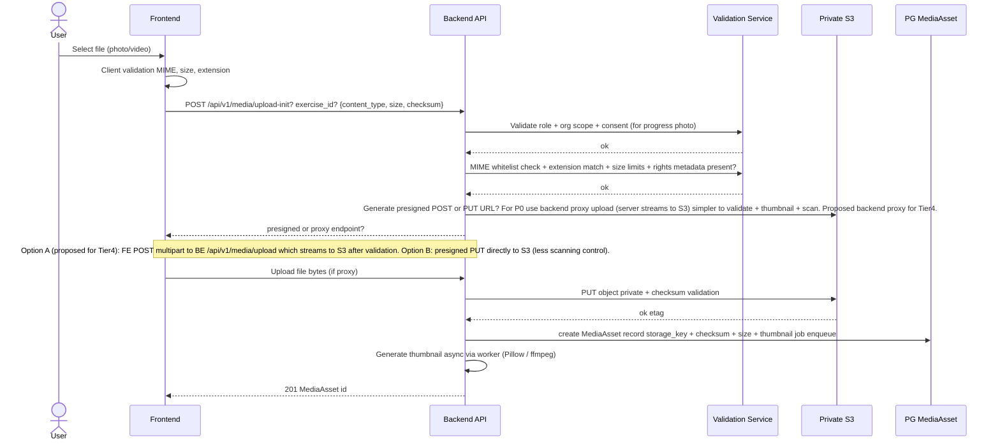
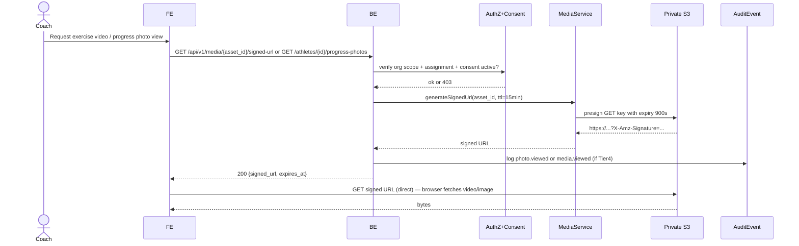

# Media Storage & Rights Architecture — CoachOS

**Version:** 1.0.0 Phase 03  
**Status:** Proposed  
**Constraint:** No public bucket listing, no public progress-photo URLs, private S3-compatible private storage only.

---

## 1. Media Types & Classification

| Media Type | Classification | Example | Storage Bucket (Proposed) | Public? | Signed URL? | Thumbnail Strategy |
|------------|----------------|---------|---------------------------|---------|-------------|-------------------|
| Exercise demo video (canonical global) | Tier0 Public Metadata but still private bucket + signed URL optional? Can be cached CDN but origin private | Barbell Bench Press demo mp4 | `coachos-media-private` / `exercises/canonical/{id}/` | No public listing; via signed URL or CDN signed; can be long cache via CDN if signed | Presigned GET TTL ≤15min or CDN signed |
| Exercise demo image (canonical) | Tier0 | Exercise illustration webp | same bucket | No public listing | Signed or CDN | Thumbnail 256px webp |
| Exercise demo video (org-private custom) | Tier2 Proprietary org IP | Custom B-Stance Hip Thrust | `coachos-media-private/org/{org_id}/exercises/{id}/` | No | Signed URL TTL ≤15min + org scope check | 256px |
| Progress photo (athlete private) | Tier4 Sensitive Personal — most sensitive | Front/side/back physique | `coachos-progress-private/athletes/{athlete_id}/` or same bucket separate prefix | **Never public, never CDN long-cache** | Signed URL TTL ≤15min — gated consent + assignment | Thumbnail 256px + 512px blurred? But even thumbnail via signed URL |
| Org branding logo | Tier1 | Gym logo png | `coachos-org-logos/org/{org_id}/` | Can be public? Propose private but with longer TTL 1h signed or public if owner marks public? For branding, allow public read via CDN? Safer default private with signed. | Signed or public if designated public bucket separate? Proposal private default |
| Export ZIP temporary | Tier1-4 mixed (own user data) | Export archive zip | `coachos-exports-tmp/exports/{user_id}/{export_id}.zip` | No | Signed URL TTL 24h via email, single-use? | N/A |
| Future transcoded video renditions | varies | 720p, 480p, 1080p | same private bucket with rendition prefix | No | Signed | N/A |

**Bucket naming is illustrative** — finalize in Phase04 infra setup, pending founder S3 provider (AWS S3, Cloudflare R2, MinIO, etc). All buckets private.

---

## 2. Bucket Boundaries & Configuration (Proposed)

- **Buckets:**
  - `coachos-media-private` — canonical + org-private exercise media (images + videos)
  - `coachos-progress-private` — progress photos (Tier4 isolated bucket for extra audit)
  - `coachos-org-logos-private` — organization logos
  - `coachos-exports-tmp` — temporary export ZIPs with lifecycle expiration 7 days (proposed)
- **Common settings:**
  - `BlockPublicAcls: true`, `IgnorePublicAcls: true`, `BlockPublicPolicy: true`, `RestrictPublicBuckets: true`
  - `Versioning: Enabled` — for recovery, not exposed publicly.
  - `ServerSideEncryption: AES256 / aws:kms` (proposed SSE-S3)
  - `ObjectLock: disabled for MVP? But audit maybe? Deferred`
  - No static website hosting.
  - No public bucket policy.
  - CORS configured to allow `GET` from app origin only if direct S3 access ever needed (but prefer Backend presigned, not direct frontend to S3 CORS).
- **Lifecycle:**
  - `exports-tmp` → expire after 7 days (proposed), `AbortIncompleteMultipartUpload` after 1 day.
  - Logs bucket? Separate access logs bucket if needed.

---

## 3. Upload Flow & Validation

**Upload Validation Rules:**

- **MIME/Extension Whitelist:**
  - Images: `image/jpeg`, `image/png`, `image/webp` → extensions `.jpg`, `.jpeg`, `.png`, `.webp`
  - Videos: `video/mp4`, `video/webm` (restrict to mp4 for MVP) → `.mp4`
  - Reject: `application/x-php`, `text/html`, `application/octet-stream` disguised, etc.
  - Validate both `content-type` header and file magic bytes (use `python-magic` lib) — extension does not trust client.
- **Size Limits (Proposed, requires validation):**
  - Progress photo image: max 10MB
  - Exercise demo image: max 5MB
  - Exercise demo video: max 100MB (MVP), future transcoding reduces.
  - Org logo: max 2MB
- **File Name:** Sanitize, never use user-supplied name as storage key — generate UUIDv7 key `prefix/{uuid}.ext`.
- **Checksums:** Compute SHA256 on backend, compare client-provided checksum if present.
- **Provenance/Rights Metadata Mandatory:** For exercise media, `license_type`, `creator_attribution`, `source_url` etc required at upload time (MediaRights).

---

## 4. Signed URL Generation

### 4.1 Principles

- **Never public URL.** All reads via presigned GET generated server-side after AuthZ + Consent check.
- **TTL:** ≤ 15 minutes for Tier0/2 (exercise demos) and Tier4 (progress photos). For export ZIPs, TTL 24h proposed via email link (longer because user needs time).
- **Generation:** Use S3 `generate_presigned_url` with `ExpiresIn=900` (15min). For Cloudflare R2 similar.
- **Audit:** For Tier4 progress photo signed URL generation, log `photo.viewed` AuditEvent with actor, target athlete, IP hash.
- **No Bucket Listing:** `ListObjects` disallowed for app role, only `GetObject` via presigned.

### 4.2 Flow

**CDN Variant:** If CloudFront CDN used, generate CloudFront signed URL or signed cookies with Origin Access Identity (OAI) — still TTL 15min.

---

## 5. Thumbnail Strategy

- **Images:** On upload, Celery worker generates thumbnails 256px, 512px webp via Pillow (PIL). Store thumbnail with key `.../thumbnails/{uuid}_256.webp`.
- **Videos:** Extract poster frame via ffmpeg at 1s or 3s? Proposed 2s. Generate thumbnail 480px webp + optional short preview gif? MVP thumbnail only to reduce processing. Future video transcoding (Phase12) will generate renditions 480p/720p.
- **Progress Photos Thumbnails:** Even thumbnails via signed URL — no public thumbnails.
- **No Client-Side Thumbnail Overwrite:** Server generates only.

---

## 6. Malware / Virus Scanning Strategy (Proposed)

- **P0 MVP:** Basic MIME + magic bytes validation; ClamAV optional but recommended in CI? Not mandatory for P0 pilot.
- **Phase13 QA:** Integrate ClamAV scan in Celery worker before marking MediaAsset as ready — if infected, mark status `quarantined` + notify uploader + delete S3 object + audit `media.quarantined`.
- **Config:** `pyclamd` or sidecar `clamav` service in worker container; update virus DB daily.
- **Status:** Proposed, not implemented; listed in SECURITY_CONTROL_MATRIX.

---

## 7. Provenance and License Metadata

Every `MediaAsset` must have `MediaRights` row:

- `license_type` enum: `original_production` (coach/org created), `licensed_cc_by`, `commercial_license`, `coach_upload` (private custom).
- `source_url` nullable — original provenance link if licensed.
- `creator_attribution` string — creator/owner credit required.
- `permitted_commercial_use` bool — legal verification flag.
- `reviewed_by_user_id` + `reviewed_at` — admin reviewer for canonical global assets.

**Workflow:** When coach creates custom exercise with media, they must select license type + attribution. System stores but does not require admin review for private custom (org-private). Canonical submissions → `pending_review` status → admin moderation queue (`SCR-ADMIN-02`) → Approve publishes to global.

---

## 8. Copyright Takedown Workflow

1. Reporter (coach, external) files takedown request via support email or admin tool (future).
2. Platform Admin opens Media Asset detail, verifies rights metadata, reviews `source_url`.
3. If infringement suspected: set `Exercise.status = archived` or `MediaAsset.status = quarantined`, remove signed URL ability (archive), keep audit.
4. Notify submitting coach with reason structured feedback (per USER_FLOWS admin flow).
5. Log `copyright.takedown_executed` AuditEvent.
6. If counter-notice, admin can restore after review.

---

## 9. Athlete Progress-Photo Access Control (Detailed)

- Bucket isolated for Tier4.
- Backend enforces:
  - Athlete self: can list own photos via `GET /api/v1/athletes/me/progress-photos` or `/athletes/{id}` where `id==self`.
  - Assigned coach: requires active `CoachAthleteAssignment` + active `ConsentRecord` where `grantee=coach`, `type=progress_photo`, `is_granted=true`, `revoked_at IS NULL`.
  - Owner: DENIED unless athlete has granted consent to owner explicitly as grantee OR owner has audited escalation break-glass (`admin.break_glass_access` style but for owner?). For MVP, propose owner cannot view raw photo without explicit consent granted to owner as grantee type same as coach. So athlete must separately consent to owner if they want owner to see? Or owner consent derived from coach consent? Simplest: Owner requires same consent record where grantee is owner. Implement separate consent for owner.
  - Support: DENIED always (0 access) per matrix.
  - Platform admin: audited escalation only, requires MFA + reason + audit.

See `AUTHORIZATION_ARCHITECTURE.md` for matrix.

---

## 10. Future Video Transcoding & CDN

- **Future transcoding (Phase12+):** Use AWS MediaConvert or ffmpeg worker to generate multiple renditions (480p, 720p) for exercise demos to save mobile bandwidth. Store renditions with suffix `_480.mp4`, `_720.mp4`.
- **CDN rules:**
  - For canonical exercise media (Tier0), CDN may cache with long TTL (1 day) but origin still private + signed URL? Actually if CDN signed URLs used, cache at edge keyed by signed URL? Safer to cache per object with signed URL verification at edge (CloudFront signed cookies). For MVP, no CDN caching for private media, only direct S3 presigned.
  - For Tier4 progress photos, NO CDN caching — `Cache-Control: private, no-store, max-age=0`. Never cache.
  - All CDN logs must not contain PII health data.

---

## 11. Retention & Deletion

- Exercise media: archived via soft-delete; S3 object remains but marked archived_at; eventual hard delete after 30 days proposed + audit.
- Progress photos: hard deleted on erasure request or when athlete deletes individual photo (propose allow delete own). On erasure, S3 delete + audit `photo.deleted`.
- Export ZIP tmp: lifecycle rule delete after 7 days (proposed) + immediate delete after download? Proposal immediate delete after successful download + lifecycle as fallback.

---

## 12. References

- `ERD.md` MediaAsset, MediaRights, ProgressPhoto
- `AUTHORIZATION_ARCHITECTURE.md` photo access matrix
- `THREAT_MODEL.md` threats: progress-photo exposure, malicious media uploads, SSRF via media URLs
- `PRIVACY_DATA_LIFECYCLE.md` Tier4 retention
