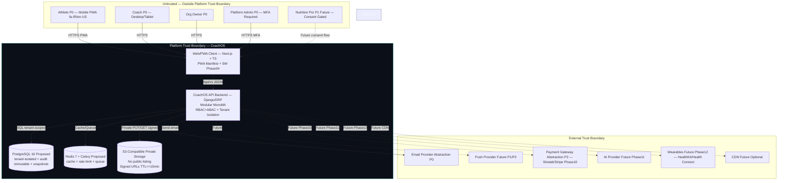

# System Context Architecture — CoachOS

**Document version:** 1.0.0 (Phase 03 Baseline)  
**Last updated:** 2026-08-10 (UTC)  
**Status:** Proposed / Accepted pending founder review  
**Languages:** Persian `fa-IR` RTL, English `en-US` LTR only — Arabic out of scope  
**Architectural Style:** C4 Level 1 — System Context

---

## 1. Purpose

This document defines the system-context boundaries for CoachOS as a B2B2C multi-tenant SaaS fitness coaching platform. It distinguishes current P0 components, P1/P2 future components, external services, trust boundaries, and sensitive-data boundaries.

No application code is created in this phase; diagrams are specification artifacts only.

---

## 2. Actors (Primary & Future)

| Actor | Type | P0/P1/P2 | Description | Trust Boundary |
|-------|------|----------|-------------|----------------|
| Athlete | Human User | P0 | Executes workouts via mobile-first PWA; logs sets; views progress; messages coach | Untrusted external — authenticated |
| Coach | Human User | P0 | Builds programs, assigns to athletes, reviews logs, messages athletes | Untrusted external — authenticated |
| Organization Owner | Human User | P0 | Manages gym tenant, invites coaches/athletes, reviews audit, manages members | Untrusted external — authenticated + org Owner role |
| Platform Administrator | Human User | P0 | Moderates exercise catalog, manages global tenants, reviews security audit | Semi-trusted internal — requires MFA + break-glass audit |
| Support Staff | Human User (optional) | P0 optional | Read-only assistance for org | Authenticated, restricted |
| Nutrition Professional | Human User | P1 | Delivers meal plans under explicit athlete consent | Future — consent-gated, not in P0 |
| Marketplace Buyer/Seller | Human User | P2 | Discovers/purchases programs | Future — out of P0 scope |
| System / Cron | System Actor | P0 | Background jobs, expiration, notifications | Trusted internal service |

---

## 3. System Context Diagram (Mermaid C4 Context)

```mermaid
C4Context
    title System Context Diagram — CoachOS (P0 + P1/P2 Future)

    Person_Ext(athlete, "Athlete (P0)", "Mobile PWA user logging workouts")
    Person_Ext(coach, "Coach (P0)", "Desktop/tablet program builder")
    Person_Ext(owner, "Organization Owner (P0)", "Gym tenant admin")
    Person_Ext(admin, "Platform Admin (P0)", "Global catalog & security")
    Person_Ext(nutri, "Nutrition Professional (P1 Future)", "Consent-gated meal planning")

    System_Boundary(c1, "CoachOS Platform (Trust Boundary: Platform)") {
        System(web, "Web/PWA Client (Next.js)", "P0 — React + TypeScript + PWA Manifest + Service Worker (Phase 04 foundation)")
        System(api, "CoachOS API / Backend (Django+DRF)", "P0 — RBAC + ABAC, multi-tenant, modular monolith")
        SystemDb(pg, "PostgreSQL 16 (Proposed)", "Primary relational store — tenant-isolated + immutable audit + program snapshots")
        SystemDb(redis, "Redis 7 + Celery (Proposed)", "Cache, rate-limit, task queue for exports, emails, notifications")
        SystemDb(obj, "S3-Compatible Object Storage (Private)", "Private buckets — signed URLs only — no public listing")
    }

    System_Ext(email, "Email Provider Abstraction", "Transactional email — invite, reset, export link — P0")
    System_Ext(pushFuture, "Push Notification Service (Future)", "Web Push / FCM — P1/P2 evaluation — NOT in P0")
    System_Ext(paymentFuture, "Payment Provider Abstraction (Future)", "Shetab domestic / Stripe international — Phase 10 — NOT in P0")
    System_Ext(aiFuture, "AI Provider Abstraction (Future)", "Constrained copilot — human-in-loop — Phase 11 — NOT in P0")
    System_Ext(wearableFuture, "Wearable Integrations (Future)", "HealthKit / Health Connect / Garmin — Phase 12 eval — NOT in P0")
    System_Ext(cdnFuture, "CDN (Future Optional)", "Private media via signed URL + CDN edge — Phase 04+ — conditional")

    Rel(athlete, web, "Uses (HTTPS, PWA installed)", "Mobile gym floor, fa-IR RTL / en-US LTR")
    Rel(coach, web, "Uses (HTTPS)", "Program builder, desktop/tablet")
    Rel(owner, web, "Uses (HTTPS)", "Org management")
    Rel(admin, web, "Uses (HTTPS + MFA)", "Moderation, audit")
    Rel(nutri, web, "Uses (Consent-gated, P1)", "Meal planning — future")
    Rel(web, api, "REST /api/v1 JSON + auth (HttpOnly cookie / Bearer)", "TLS 1.3")
    Rel(api, pg, "Reads/Writes tenant-isolated", "SQL via ORM, PgBouncer optional")
    Rel(api, redis, "Cache, rate-limit counters, Celery tasks")
    Rel(api, obj, "Private upload / presigned GET (TTL <=15min)")
    Rel(api, email, "Sends via abstraction", "Invite, reset, export")
    Rel(api, pushFuture, "Future adapter — not in P0", "Dashed — deferred")
    Rel(api, paymentFuture, "Future adapter — not in P0", "Dashed — deferred")
    Rel(api, aiFuture, "Future adapter — not in P0", "Dashed — deferred")
    Rel(api, wearableFuture, "Future eval — not in P0", "Dashed — deferred")
    Rel(api, cdnFuture, "Future — signed URL via CDN", "Conditional")

    UpdateLayoutConfig($c4ShapeInRow="4", $c4BoundaryInRow="1")
```

**GitHub Markdown Rendering Note:** Uses `C4Context` — if renderer does not support C4, fallback Mermaid below renders equivalent.

### Fallback Mermaid (Generic)

---

## 4. Trust Boundaries (Explicit)

1. **Browser/PWA ↔ API Gateway (TLS 1.3, HSTS):** All traffic over HTTPS; cookies `HttpOnly; Secure; SameSite=Lax`; CSRF double-submit where cookie auth used.
2. **API ↔ PostgreSQL:** Private VPC/network; credential via Secrets Manager; no secrets in repo.
3. **API ↔ Redis:** Private network; TLS optional depending on provider; no PII in cache keys.
4. **API ↔ Object Storage:** Private buckets `BlockPublicAcls=true`, no listing; signed URLs only with TTL ≤ 15 min; MIME validation + virus scanning hook.
5. **API ↔ External Email:** Adapter interface; provider API key via env; DKIM/SPF enforced por founder infra.
6. **Platform Admin Break-Glass:** Separate MFA step; audited escalation events for sensitive reads (photos, messages, global audit).

---

## 5. Sensitive-Data Boundaries

| Data Class | Location | Boundary Protection |
|------------|----------|---------------------|
| **Tier 0 Public Metadata** | PG (Exercise public fields) + CDN cacheable | Public GET but moderation-gated |
| **Tier 1 Account/Identity** | PG `User`, `Organization` | Encrypted transit + at-rest (provider AES-256); Argon2id hash |
| **Tier 2 Coaching Operational** | PG Programs, Sets | Tenant isolation via org_id filter |
| **Tier 3 Sensitive Health-Adjacent (pain flags, body metrics)** | PG `FeedbackFlag`, `BodyMetric` | Assigned coach only via CoachAthleteAssignment; Owner aggregate only; audited reads |
| **Tier 4 Progress Media** | Private S3 + PG pointer | Never public; signed URL + consent; support DENIED |
| **Tier 5 Audit Logs** | PG `AuditEvent` append-only | Immutable; no UPDATE/DELETE via app user |
| **Tier 6 Secrets** | Secrets Manager / env | Never in repo |

---

## 6. P0 / P1 / P2 Separation

- **P0 (Current):** Web/PWA client shell, Django API, PostgreSQL, Redis/Celery, S3 private, Email abstraction.
- **P1 (Future, consented):** Nutrition role, meal plans, payment abstraction (Phase 10), push basics.
- **P2 (Future, deferred):** Marketplace, AI copilot (Phase 11), wearable integrations (Phase 12), advanced push, native builds.

Diagrams MUST NOT imply P1/P2 exists in P0. All future components are dashed/different color and labeled "Future / Not in P0".

---

## 7. Assumptions & Open Decisions

- **Assumed:** PostgreSQL 16 + `pg_trgm`, `btree_gin`, `uuid-ossp/pgcrypto` extensions — to be validated in Phase 03/04 (see DECISIONS.md ADR-002).
- **Pending Founder:** License transition (ADR-012), UUIDv7 vs alternative identifier (ADR-017), monorepo structure (ADR-010).
- **Requires Implementation Validation:** PWA installability, service worker caching strategies, signed URL generation latency.

---

## 8. Compliance & Language Constraints

- Supports only `fa-IR` RTL (Vazirmatn) and `en-US` LTR (Inter). Arabic explicitly out of scope — no Arabic locale, translations, or catalogs.
- No medical diagnosis, no clinical claims (ADR-026).
- No real health data or secrets in repo (standing rule).

---

## 9. References

- `docs/PRD.md` §6 Permissions Matrix
- `docs/SECURITY_AND_PRIVACY.md` Data Classification
- `docs/DECISIONS.md` ADR-001..ADR-028
- `docs/architecture/CONTAINER_ARCHITECTURE.md`
- `docs/architecture/AUTHORIZATION_ARCHITECTURE.md`
