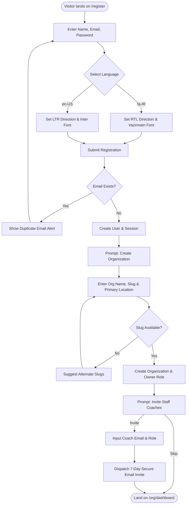
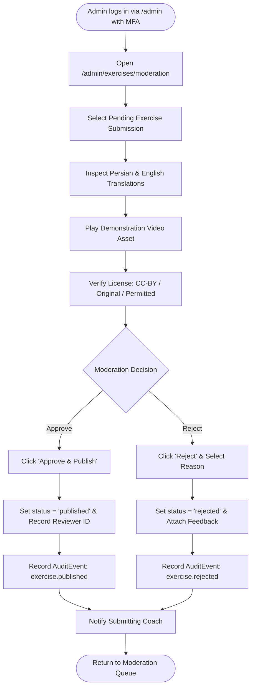

# User Flows & Interaction Workflows — CoachOS

**Document version:** 1.0.0 (Phase 02 Baseline)  
**Last updated:** 2026-08-10  
**Supported Locales:** Persian (`fa-IR`, RTL) and English (`en-US`, LTR)  
**Strict constraint:** Arabic is strictly out of scope.  
**Design Phase:** Phase 02 — Documentation and specifications only. No application source code.

---

## 1. Flow: Organization Owner Onboarding & Team Setup (UF-OWNER-01)

### 1.1 Visual Flow Diagram (Mermaid)



### 1.2 Step-by-Step Flow Specification
1. **Initial State:** Visitor arrives at `/register`.
2. **Action 1 (Credentials & Language):** User inputs display name, email, password, and selects language (`فارسی` or `English`). UI dynamically updates text direction and font without page reload.
3. **System Response & Auth:** Backend creates `User` record with salted password hash, establishes session, and routes to `/org/new`.
4. **Action 2 (Workspace Creation):** Owner enters gym name (e.g., "Alborz Fitness"), custom URL slug (`alborz-fit`), and optional primary facility address.
5. **System Response & Provisioning:** Validates slug uniqueness, creates `Organization` and primary `Location`, binds user as `Owner`, and logs audit event `organization.created`.
6. **Action 3 (Coach Onboarding):** Owner opens "Invite Coach", inputs coach email. System generates single-use 7-day token and sends localized invite email.
7. **Success End State:** Owner arrives on `/org/dashboard` displaying 1 active owner and 1 pending coach invitation.

---

## 2. Flow: Coach Program Building, Template Saving & Assignment (UF-COACH-01)

### 2.1 Visual Flow Diagram (Mermaid)

```mermaid
flowchart TD
    CoachStart([Coach logs in -> /coach/dashboard]) --> NavPrograms[Navigate to /coach/programs]
    NavPrograms --> ChooseAction{Action}
    
    ChooseAction -->|Clone Template| BrowseTemplates[Select Org Template]
    ChooseAction -->|New Program| CreateNew[Click 'New Program']
    
    BrowseTemplates --> DuplicateTemplate[Duplicate Template Structure]
    CreateNew --> EnterMeta[Input Title, Goal & Description]
    
    DuplicateTemplate --> BuilderCanvas[Open Dual-Pane Builder]
    EnterMeta --> BuilderCanvas
    
    BuilderCanvas --> AddPhase[Add Phase: e.g. Hypertrophy - 4 Wks]
    AddPhase --> AddWeekDay[Add Week 1 -> Day 1: Upper Body]
    AddWeekDay --> SearchExercise[Search Bilingual Exercise Catalog]
    
    SearchExercise -->|Persian Query with Arabic variant| FoldQuery[Character Normalization: ي->ی, ك->ک]
    FoldQuery --> ShowResults[Display Exercise Results & Cues]
    SearchExercise -->|English Query| ShowResults
    
    ShowResults --> InsertExercise[Insert Exercise into Day 1]
    InsertExercise --> ConfigPrescription[Configure Sets, Reps, Load, Tempo, RPE, Rest]
    ConfigPrescription --> GroupSuperset{Pair Superset?}
    GroupSuperset -->|Yes| SetGroupKey[Assign Group Key: A1/A2]
    GroupSuperset -->|No| SaveStructure[Persist Workout Structure]
    SetGroupKey --> SaveStructure
    
    SaveStructure --> SaveTemplateOpt[Save as Reusable Gym Template]
    SaveTemplateOpt --> AssignPrompt[Click 'Assign to Athlete']
    
    AssignPrompt --> SelectAthlete[Select Assigned Athlete & Start Date]
    SelectAthlete --> AuthCheck{Athlete Assigned to Coach?}
    AuthCheck -->|No / Cross-Tenant| DenyAssign[Reject with HTTP 403 Forbidden]
    AuthCheck -->|Yes| GenSnapshot[Generate Immutable ProgramSnapshot JSON]
    
    GenSnapshot --> NotifyAthlete[Dispatch Assignment Notification to Athlete]
    NotifyAthlete --> CoachFinish([Assignment Complete -> View Roster])
```



### 2.2 Step-by-Step Flow Specification
1. **Initial State:** Coach is authenticated on `/coach/dashboard`.
2. **Action 1 (Open Builder):** Coach navigates to Programs -> "New Program", inputs title (e.g., "8-Week Strength & Hypertrophy").
3. **Action 2 (Structure Definition):** Coach adds Phase 1 (4 Weeks) -> Week 1 -> Day 1 (Upper Body).
4. **Action 3 (Exercise Search & Normalization):** Coach types "پرس سینه" into exercise search. Search normalizes Arabic/Persian letter variants and returns "پرس سینه با هالتر" (Barbell Bench Press).
5. **Action 4 (Prescription Configuration):** Coach configures: 4 sets, 8 reps, 80kg, tempo "3-1-1-0", target RPE 8, rest 90s, cue: "Drive feet into floor".
6. **Action 5 (Superset Pairing):** Coach adds "Chest-Supported Row", groups both exercises under tag `A`, creating a superset.
7. **Action 6 (Template & Assignment):** Coach saves structure as an organization template, then taps "Assign Program", selects Athlete "Jordan", and sets start date to next Monday.
8. **System Response:** Verifies `CoachAthleteAssignment`, freezes a point-in-time `ProgramSnapshot` (JSON), creates scheduled workouts, and dispatches in-app notification to Jordan.

---

## 3. Flow: Athlete Workout Execution & Feedback Logging (UF-ATH-01)

### 3.1 Visual Flow Diagram (Mermaid)

```mermaid
flowchart TD
    AthStart([Athlete opens Mobile PWA]) --> ViewToday[Open /app/today Dashboard]
    ViewToday --> CheckScheduled{Scheduled Workout Today?}
    
    CheckScheduled -->|Rest Day| ShowRestCard[Display Rest & Recovery Screen]
    CheckScheduled -->|Yes| DisplayCard[Display 'Today's Workout' Card]
    
    DisplayCard --> TapStart[Tap 'Start Workout' Button]
    TapStart --> ActiveMode[Enter Full-Screen Active Session Mode]
    
    ActiveMode --> InspectExercise[View Exercise 1: Video Demo & Targets]
    InspectExercise --> PerformSet[Athlete Performs Set 1]
    
    PerformSet --> LogActuals[Input Actual Load: 80kg, Actual Reps: 8, RPE: 8]
    LogActuals --> TapCheck[Tap Complete Checkmark]
    
    TapCheck --> CheckNetwork{Network Online?}
    CheckNetwork -->|Yes| SaveSetServer[Sync Set Log to Server]
    CheckNetwork -->|No / Gym Drop| CacheSetLocal[Preserve in Component State (Temporary) & Show Banner: "Unsaved input retained temporarily; retry required after reconnection" — no durable queue until Phase 12]
    
    SaveSetServer --> StartTimer[Start 90s Rest Countdown Timer]
    CacheSetLocal --> StartTimer
    
    StartTimer --> MoreSets{Remaining Sets in Session?}
    MoreSets -->|Yes| PerformSet
    MoreSets -->|No| ReviewMod{Need to Substitute / Flag Pain?}
    
    ReviewMod -->|Substitute| OpenSubModal[Select Replacement Exercise & Reason]
    OpenSubModal --> FinishPrompt[Tap 'Finish Workout']
    ReviewMod -->|Flag Pain| OpenPainModal[Report Anatomical Area, Severity & Notes]
    OpenPainModal --> FinishPrompt
    ReviewMod -->|None| FinishPrompt
    
    FinishPrompt --> SummaryScreen[Open /app/workouts/:id/summary]
    SummaryScreen --> InputSessionFeedback[Input Overall Session RPE, Fatigue & Comments]
    InputSessionFeedback --> SubmitSession[Submit Completed Workout]
    
    SubmitSession --> SuccessCelebration([Display Volume Summary & Celebrate])
```

### 3.2 Step-by-Step Flow Specification
1. **Initial State:** Athlete launches CoachOS PWA on smartphone; arrives at `/app/today`.
2. **Action 1 (Launch):** Athlete views scheduled "Leg Day", taps prominent "Start Workout" button. App enters full-screen workout mode and starts session timer.
3. **Action 2 (Set Execution & Logging):** Athlete inspects prescribed Back Squats (Target: 100kg x 5). After Set 1, athlete inputs actuals (100kg, 5 reps, RPE 8) and taps the checkmark.
4. **System Response & Timer:** UI marks set complete (green check), starts 90-second countdown rest timer with visual ring and haptic notification on completion.
5. **Action 3 (Exercise Substitution):** Leg Press machine is occupied. Athlete taps "Substitute", selects "Goblet Squat", and selects reason "Equipment Unavailable".
6. **Action 4 (Pain Flag):** On Set 4 of deadlifts, athlete flags mild lower-back discomfort (Severity: 3/10).
7. **Action 5 (Session Finish & Feedback):** Athlete completes all sets, taps "Finish Workout", inputs overall exertion (RPE 7.5), and submits.
8. **Success End State:** App displays summary: *"Total Volume: 4,850 kg • Duration: 52 min"*, and notifies coach of completed session and pain alert.

---

## 4. Flow: Platform Administrator Exercise Moderation (UF-ADMIN-01)

### 4.1 Visual Flow Diagram (Mermaid)



### 4.2 Step-by-Step Flow Specification
1. **Initial State:** Platform administrator authenticates with MFA and opens `/admin/exercises/moderation`.
2. **Action 1 (Inspect Submission):** Admin selects pending submission "Bulgarian Split Squat".
3. **Action 2 (Review Content & Media):** Admin verifies that Persian cues ("اسکوات بلغاری") and English cues are accurate, checks anatomical muscle tags (Quadriceps, Glutes), and inspects video demo and licensing provenance metadata.
4. **Action 3 (Approve):** Admin clicks "Approve & Publish".
5. **System Response:** Transitions exercise status to `Published` (available in global catalog), records admin reviewer ID, logs immutable `AuditEvent`, and dispatches notification to authoring coach.
